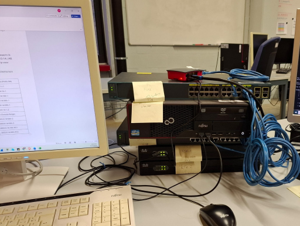

# Cisco CCNA Network Labs

**Training project** | Cisco Networking · CCNA 1 / 2 / 3

A series of three progressive network labs covering the full CCNA curriculum. Starting with basic routing and subnetting, adding switching complexity and redundancy, and finally hardening the network with ACLs and security policies. All labs were implemented on real Cisco hardware.

## Lab Overview

### Lab 1 — CCNA1: Static Routing & Subnetting
IPv4/IPv6 dual-stack network with two routers and two switches. Covers subnetting from scratch, static routing, Cisco IOS device configuration, SSH vs Telnet security analysis, and packet-level troubleshooting with Wireshark.

### Lab 2 — CCNA2: VLANs, Trunking & Switching
Multi-VLAN network with inter-VLAN routing, DHCP relay, EtherChannel (LACP), Spanning Tree, trunk configuration, port security, DHCP snooping and BPDU Guard. Significant troubleshooting involved — including multiple full restarts to track down typos in IP configuration.

### Lab 3 — CCNA3: ACLs & Security *(coming soon)*
To be added.

## Skills Demonstrated

- IPv4 & IPv6 subnetting and addressing
- Cisco IOS router and switch configuration via CLI
- Static routing and inter-VLAN routing (Router-on-a-stick)
- VLANs, trunking (802.1Q), native VLANs
- EtherChannel (LACP), Spanning Tree Protocol, BPDU Guard
- DHCP server, relay agent and snooping
- Port security (static & sticky)
- SSH configuration and Telnet vulnerability analysis
- Packet capture and analysis with Wireshark
- Network troubleshooting methodology
